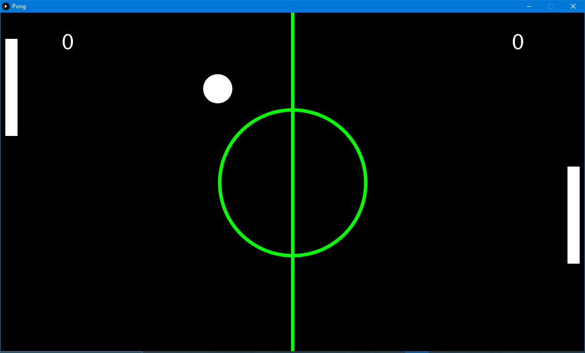
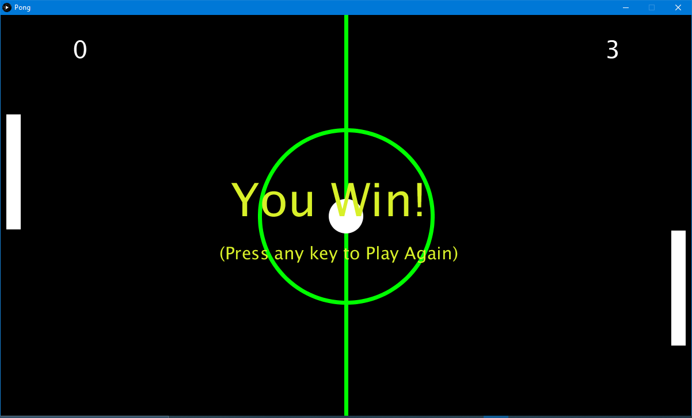
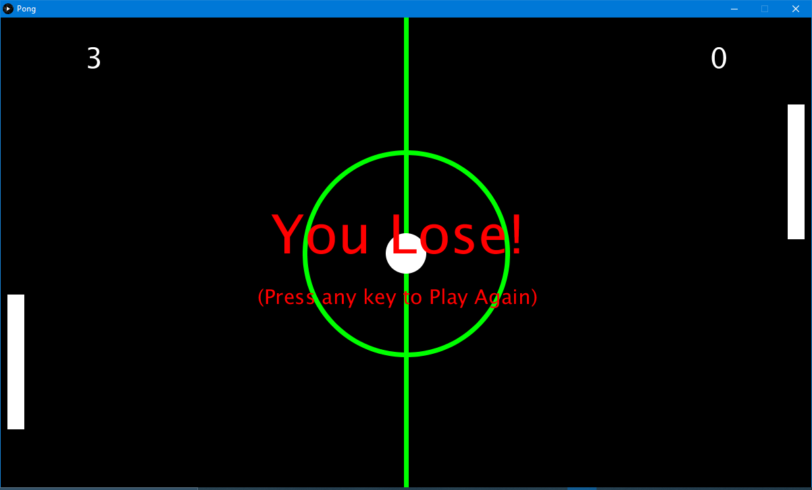

# Pong
Pong made in Processing using Python

This was made for my midterm project in the Computational Media course at the University of Mississippi. The assignment was to use the lessons we were
taught previously in the course and make something creative. It required a little bit more than what we had learned at the time, but I thought it would
be fun to recreate Pong.

# The Game

This is a screenshot of the game being played

# Win or Lose

Once either the player, who is controlled by the user’s mouse Y-axis, or the opponent score 3 points a respective win or lose screen will appear and the user may restart the game by pressing any key.
